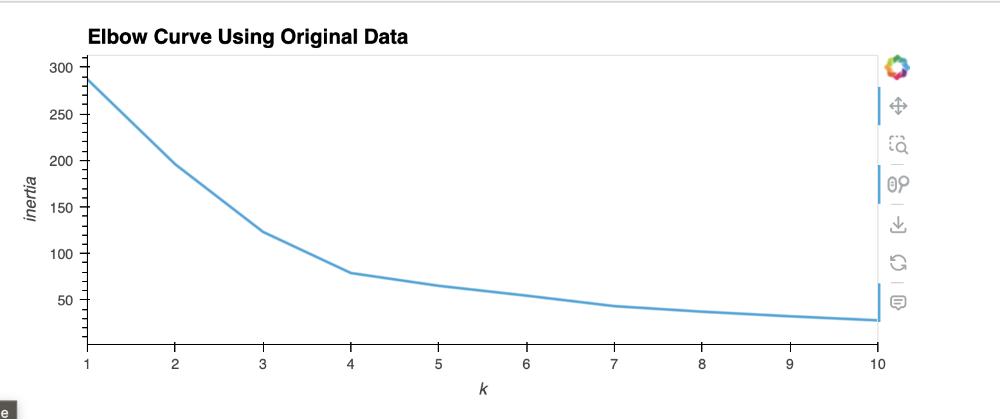
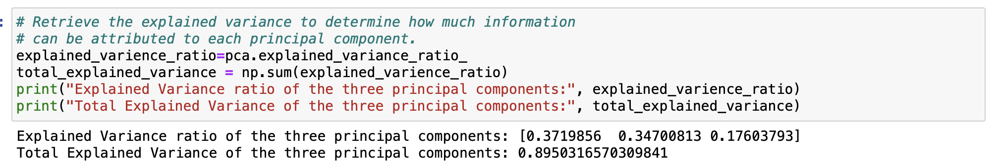
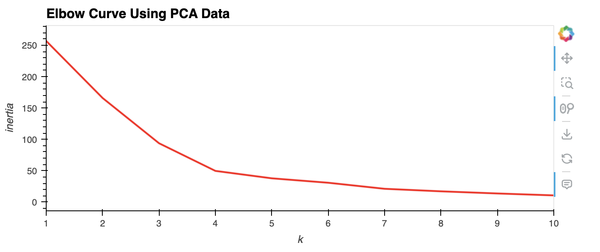
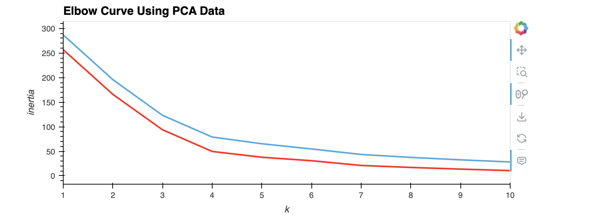
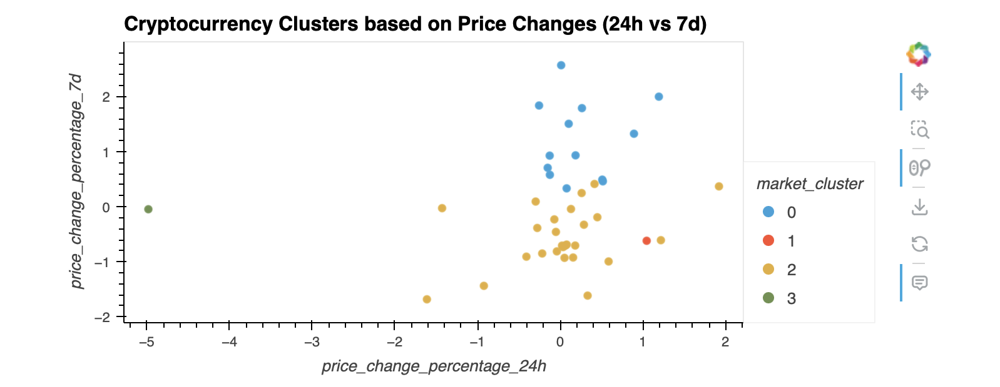
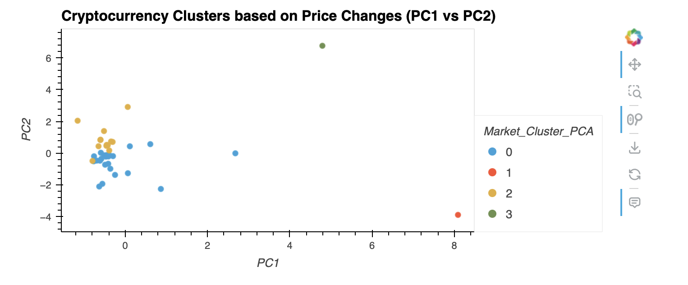

# Cryptocurrency Clustering Analysis

This project involves clustering analysis of cryptocurrency market data using K-means clustering algorithm and Principal Component Analysis (PCA). The analysis aims to identify patterns and groupings within the cryptocurrency market.

## Tools Used:
- **Python**: Programming language used for data manipulation and analysis.
- **Jupyter Notebook**: Interactive development environment for running Python code and documenting the analysis.
- **scikit-learn**: Python library used for machine learning tasks, including K-means clustering and PCA.
- **pandas**: Python library used for data manipulation and analysis.
- **hvPlot**: Interactive plotting library compatible with pandas DataFrames.
## Features
### Load and Explore Data:
- Load `crypto_market_data.csv` into a DataFrame.
- Get summary statistics and plot the data to understand its structure.

### Prepare Data:
- Normalize the data using StandardScaler().
- Create a DataFrame with scaled data and set "coin_id" as the index.

### Find Best Value for k (Original Scaled DataFrame):
- Use elbow method to find optimal k.
  - Create a list with the number of k values from 1 to 11.
  - Create an empty list to store the inertia values.
  - Create a for loop to compute the inertia with each possible value of k.
  - Create a dictionary with the data to plot the elbow curve.
- Plot a line chart with all the inertia values computed with the different values of k to visually identify the optimal value for k.
- Answer the following question: What is the best value for k?

### Cluster Cryptocurrencies with K-means (Original Scaled Data):
- Initialize K-means model with best k.
- Fit model and predict clusters.
- Create scatter plot to visualize clusters.

### Optimize Clusters with PCA:
- Perform PCA on original scaled data.
- Retrieve explained variance and answer question.
- Create DataFrame with PCA data.

### Find Best Value for k (PCA Data):
- Use elbow method on PCA data.
  - Create a list with the number of k-values from 1 to 11.
  - Create an empty list to store the inertia values.
  - Create a for loop to compute the inertia with each possible value of k.
  - Create a dictionary with the data to plot the Elbow curve.
- Plot a line chart with all the inertia values computed with the different values of k to visually identify the optimal value for k.
- Answer the following question: What is the best value for k when using the PCA data? Does it differ from the best k value found using the original data?

### Cluster Cryptocurrencies with K-means (PCA Data):
- Initialize K-means model with best k from PCA.
- Fit model and predict clusters.
- Create scatter plot to visualize clusters and answer question: What is the impact of using fewer features to cluster the data using K-Means?

## Report

**What is the best value for k when using the original data?**

* The best value for k when using the original data is determined to be 4.

**What is the total explained variance of the three principal components?**

* The total explained variance of the three principal components is approximately 0.895, indicating that these components collectively account for around 89.50% of the total variance in the data.

**What is the best value for k when using the PCA data?**

* According to the plot, the optimal number of principal components (k) for the PCA data is determined to be 4.

**Does it differ from the best k value found using the original data?**

* The inertia decreased from 79.022 for the original data to 49.665 for the PCA-transformed data, despite both resulting in the same optimal k value of 4.

**After visually analyzing the cluster analysis results, what is the impact of using fewer features to cluster the data using K-Means?**

* Reduction in Inertia: Using PCA for dimensionality reduction results in a higher reduction rate of the initial inertia compared to using standardized data directly. This indicates that PCA components are more efficient in setting up the data for clustering.

* No Change in Clusters: Despite reducing the dimensions from seven to three using PCA, the clusters obtained remain the same as those obtained with the original data. This suggests that PCA is effective in retaining the essential information needed for clustering while reducing the complexity of the data.
## Data Sources

The dataset used in this analysis was sourced from `crypto_market_data.csv`. This dataset contains information about various cryptocurrencies traded in the market, including their price changes, trading volumes, and other relevant metrics.

#### Dataset Description:
- **File Name**: crypto_market_data.csv
- **Format**: Comma-separated values (CSV)
## Conclusion
In conclusion,  both the original scaled data and the PCA-transformed data resulted in the same optimal number of clusters (k=4) based on the elbow method. However, PCA offered advantages in terms of dimensionality reduction, leading to a significant reduction in inertia while retaining essential information for clustering. Therefore, leveraging PCA for dimensionality reduction and subsequent clustering may be considered the best approach, as it improves efficiency and simplifies the data structure without compromising clustering outcomes.

## Acknowledgements

 - [Ashlin Shinu George]

